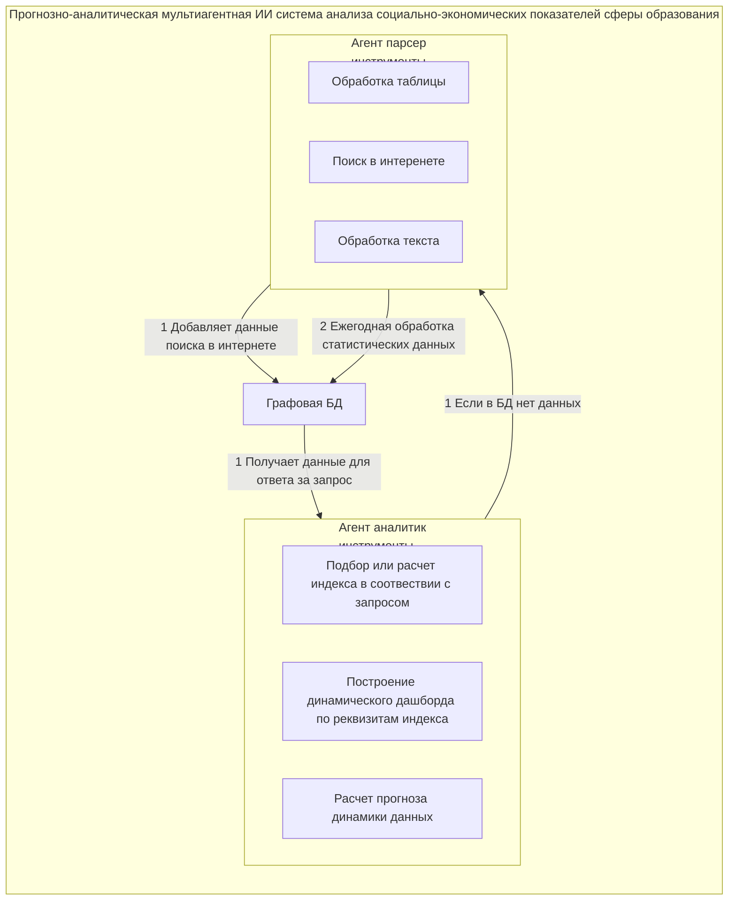

# Краткое содержание бизнес-плана: Прогнозно-аналитическая мультиагентная ИИ система для социально-экономических показателей в сфере образования

## 1. Суть проекта

**Название**: Прогнозно-аналитическая мультиагентная ИИ система для социально-экономических показателей в сфере образования

**Цель**: Создание интеллектуальной системы для анализа и прогнозирования образовательных данных России с использованием современных технологий ИИ.

## 2. Научно-техническая новизна

### Ключевые технологии:
- **GraphRAG** для образовательной аналитики - повышение точности ответов на 25-40%
- **Мультиагентная архитектура** с специализированными ИИ-агентами 
- **Пространственно-временное моделирование** с региональными данными
- **Графовая база данных Neo4j** для хранения связанных данных
- **Few-shot обучение** для адаптации к новым задачам

### Показатели эффективности:
- Точность извлечения фактов: **92%+**
- Снижение галлюцинаций до **15%** (базовый RAG: 25-30%)
- Точность краткосрочных прогнозов: **MAPE < 8%** (федеральный уровень)
- Скорость обработки запросов: **в 3-5 раз быстрее**
- Точность агентских систем: **87-92%**

### Научная новизна:
- Первая интеграция GraphRAG с мультиагентными системами для образовательной аналитики
- Адаптивная онтологическая модель с самообучением на базе 60,000+ научных статей
- Использование региональных данных для повышения точности федеральных прогнозов

## 3. Создаваемый продукт

### Функциональные возможности:

**1. Анализ неструктурированных данных:**
- NLP-обработка документов СССР и современных данных
- OCR для PDF, парсинг Excel с объединенными ячейками
- Few-shot обучение для новых типов документов (85%+ точность)
- Обработка опросов населения и независимых отчетов

**2. Построение полного индекса:**
- Автоматическое создание макроиндексов: Наука, Воспитание, Экономика
- Проверка полноты данных по 85 субъектам РФ
- Математические формулы расчета с методологическим обоснованием

**3. Прогнозная модель:**
- Автоматическое восстановление пропущенных данных
- Согласование федеральных и региональных данных
- Сценарное моделирование "что-если"

**4. Интеллектуальная визуализация:**
- Дашборды с шаблонами графиков
- Интерактивные карты России с региональными показателями
- Временные ряды данных

## 4. Архитектура системы

**Архитектура мультиагентой ИИ системы**

### Имеющийся задел:
- **Прототип 1**: Система анализа статистических форм (2015-2024, 85 регионов РФ)
- **Прототип 2**: Агент-аналитик на базе LangGraph
- Обработка ~850 Excel файлов образовательной статистики

## 5. Рынок и конкуренты

### Размер рынка:
- **EdTech Market Intelligence**: 8,33 млрд рублей (РФ), 15 млрд долларов (мир)
- **GovTech AI сегмент**: 48,66 млрд рублей (РФ), 14,57 млрд долларов (мир)
- **Science AI**: развивающийся сегмент

### Конкуренты:

**Зарубежные аналоги:**
- **HolonIQ** - глобальная платформа market intelligence для образования

**Российские аналоги по функциональности:**

**По бизнес-модели:**
- **Консультант+** - справочно-правовая система (1,000-10,000 руб/месяц)
- **Руспрофайл** - бизнес-аналитика компаний РФ (470 руб/месяц)

**По технологиям ИИ:**
- **INVENTORUS** - научно-техническая аналитика с RAG (3,750 руб/месяц)

**По образовательным данным:**
- **ВШЭ "Индикаторы образования"** - 57 статических дашбордов (бесплатно)
- **Росстат образование** - 8 дашбордов официальной статистики (бесплатно)

**Конкурентные преимущества создаваемого продукта:**
- Динамическое построение дашбордов vs статические шаблоны
- GraphRAG технология для максимальной точности данных
- Комплексный охват всех статистических форм образования
- Мультиагентная ИИ архитектура
- Социально-ориентированное ценообразование

## 6. Целевые сегменты клиентов

### 1. Граждане РФ (бесплатный сегмент)
- **Аудитория**: 146 млн человек
- **Ценность**: источник данных, обратная связь, социальное доверие

### 2. Научно-исследовательские организации
- **Количество**: 16 подтвержденных организаций (11 НИИ + 5 вузов)
- **Цена**: 36,000 руб/год
- **Потенциал**: 576 тыс. руб/год

### 3. Образовательные организации
- **Количество**: ~70 организаций (50 частных вузов + 20 EdTech)
- **Цена**: 36,000 руб/год  
- **Потенциал**: 2,52 млн руб/год

### 4. Органы государственного управления
**Федеральный уровень:**
- **Количество**: 8 ведомств (Минпрос, Минобрнауки, Рособрнадзор и др.)
- **Цена**: 10 млн руб/год
- **Потенциал**: 80 млн руб/год

**Региональный уровень:**
- **Количество**: 85 субъектов РФ
- **Цена**: 1 млн руб/год
- **Потенциал**: 85 млн руб/год

### Общий рыночный потенциал:
- **Достоверный минимум**: 168,1 млн руб/год
- **Реалистичные прогнозы**: Год 1: 8,4 млн, Год 2: 25,2 млн, Год 3: 42,0 млн

## 7. Модель ценообразования

### Социально-ориентированная модель:
- **Образовательные организации**: единая цена 3,000 руб/месяц
- **Государственные органы**: индивидуальные контракты (основная прибыль)
- **Граждане**: бесплатное использование

### Структура издержек:
- **API затраты**: 489,500 руб/месяц (для госсегмента)
- **Серверная инфраструктура**: 405,300 руб/месяц (локальная LLM)
- **Разработка и поддержка**: переменные затраты

## 8. Бизнес-модель (Canvas)

### Ценностные предложения:
- **Граждане**: доступная аналитика, участие в развитии
- **Малые организации**: уникальные инструменты по доступной цене
- **Крупные клиенты**: комплексный анализ, интеграция систем, консалтинг

### Каналы сбыта:
- Академические публикации и конференции
- Прямые контакты с образовательными учреждениями
- Telegram-бот и веб-портал
- Корпоративные интеграции

### Ключевые ресурсы:
- Собственная база данных образовательной статистики
- Алгоритмы анализа неструктурированных данных
- Графовая база знаний и индексы
- Команда разработчиков и аналитиков

## 9. Интеллектуальная собственность

### Планируемые РИД:
- **Действующий РИД №2024613709** - БД стартапов и проектов
- **Новый РИД** - БД данных об образовании (коммерческий)
- **OpenSource РИД** - агенты и прогнозные модели

### Авторские права:
- Коммерческие компоненты: ООО "СТАРТЕХ БАЗА"
- Открытые компоненты: OpenSource лицензии

## 10. Преимущества и уникальность

### Конкурентные преимущества:
- Единственная система в РФ с полным покрытием образовательной статистики
- Интеграция 10 лет данных по всем 85 субъектам РФ
- Мультиагентная архитектура с GraphRAG
- Социально-ориентированная модель ценообразования
- Научно обоснованные методы повышения точности

### Технологические преимущества:
- Исключение галлюцинаций через онтологии НПА
- Автоматическое обновление базы знаний
- Пространственно-временное моделирование
- Адаптивность к новым типам документов