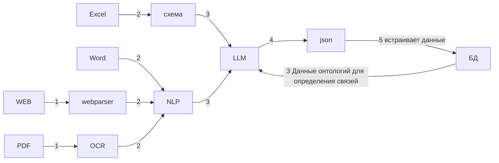
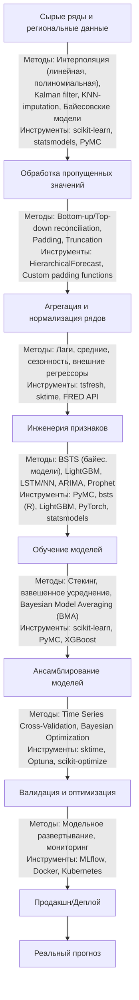
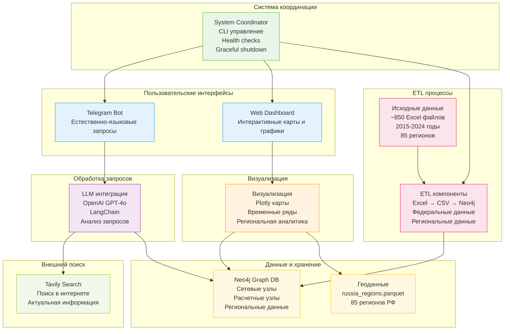
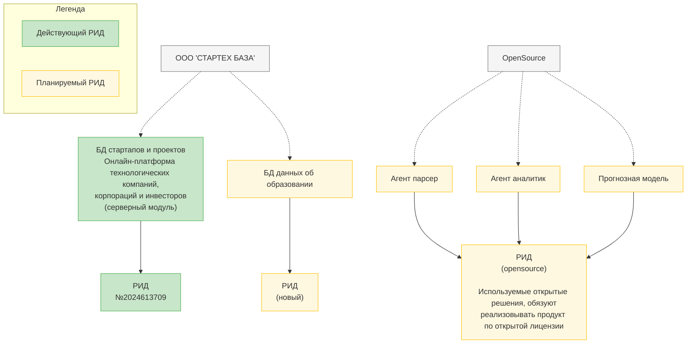

# Бизнес-план по реализации прогнозно-аналитической мультиагентной ИИ системы для социально-экономических показателей в сфере образования

## Оглавление

- [1. Участник отбора](#1-участник-отбора)
  - [1.1. Название проекта](#11-название-проекта)
- [2. Научная составляющая проекта](#2-научная-составляющая-проекта)
  - [2.1. Научно-техническая новизна и обоснование предлагаемых в проекте решений](#21-научно-техническая-новизна-и-обоснование-предлагаемых-в-проекте-решений)
    - [Комплекс используемых технологий](#комплекс-используемых-технологий)
    - [Показатели повышения точности и производительности](#показатели-повышения-точности-и-производительности)
    - [Научное обоснование с конкретными исследованиями](#научное-обоснование-с-конкретными-исследованиями)
    - [Фундаментальная научная новизна](#фундаментальная-научная-новизна)
  - [2.2. Создаваемый коммерческий продукт и его характеристики](#22-создаваемый-коммерческий-продукт-и-его-характеристики)
    - [2.2.1. Функциональное назначение](#221-функциональное-назначение)
    - [2.2.2. Основные потребительские качества](#222-основные-потребительские-качества)
    - [2.2.3. Параметры продукта](#223-параметры-продукта)
  - [2.3. Методы и способы решения поставленных задач](#23-методы-и-способы-решения-поставленных-задач)
  - [2.4. Наименование и производитель планируемой к замещению продукции](#24-наименование-и-производитель-планируемой-к-замещению-продукции)
  - [2.5. Имеющийся у коллектива участника отбора научно-технический задел](#25-имеющийся-у-коллектива-участника-отбора-научно-технический-задел)
  - [2.6. Планы по созданию и защите интеллектуальной собственности](#26-планы-по-созданию-и-защите-интеллектуальной-собственности)
- [3. Перспективы коммерциализации](#3-перспективы-коммерциализации)
  - [3.1. Объем и емкость рынка продукта](#31-объем-и-емкость-рынка-продукта)
  - [3.2. Сравнение технико-экономических характеристик создаваемого инновационного продукта с зарубежными и отечественными аналогами](#32-сравнение-технико-экономических-характеристик-создаваемого-инновационного-продукта-с-зарубежными-и-отечественными-аналогами)
  - [3.3. Планируемая стоимость продукта. Расчет себестоимости](#33-планируемая-стоимость-продукта-расчет-себестоимости)
    - [Структура операционных издержек](#структура-операционных-издержек)
    - [Тарифные планы и лимиты запросов (рентабельность 50%)](#тарифные-планы-и-лимиты-запросов-рентабельность-50)
  - [3.4. Целевые сегменты потребителей создаваемого продукта и оценка платежеспособного спроса. Потенциальные клиенты (заказчики)](#34-целевые-сегменты-потребителей-создаваемого-продукта-и-оценка-платежеспособного-спроса-потенциальные-клиенты-заказчики)
    - [Сегментация потребителей по платежеспособности и потребностям](#сегментация-потребителей-по-платежеспособности-и-потребностям)
    - [Детализация потенциальных клиентов по регионам](#детализация-потенциальных-клиентов-по-регионам)
    - [Дополнительные сегменты](#дополнительные-сегменты)
    - [Консервативная оценка платежеспособного спроса (на основе достоверных данных БД)](#консервативная-оценка-платежеспособного-спроса-на-основе-достоверных-данных-бд)
  - [3.5. Информация об имеющихся соглашениях о намерениях, договорах поставки, письмах от российских организаций, подтверждающих востребованность планируемой к созданию продукции или услуги на ее основе, представленных в составе заявки на конкурс.](#35-информация-об-имеющихся-соглашениях-о-намерениях-договорах-поставки-письмах-от-российских-организаций-подтверждающих-востребованность-планируемой-к-созданию-продукции-или-услуги-на-ее-основе-представленных-в-составе-заявки-на-конкурс)
  - [3.6. Описание бизнес-модели проекта. Производственный план и план продаж](#36-описание-бизнес-модели-проекта-производственный-план-и-план-продаж)


## Глоссарий

### Научные термины

**Основные технологии искусственного интеллекта:**
- **Machine Learning (ML)** с spatial-temporal modeling для прогнозной системы
- **Large Language Models (LLM)** для работы с БД и генерации ответа
- **Natural Language Processing (NLP)** для анализа неструктурированных данных
- **Agent-based системы** с использованием специализированных инструментов (tools)
- **Few-shot** для адаптации к специфическим задачам образовательной аналитики

**Технологии работы с данными:**
- **Графовая база данных Neo4j** для хранения связанных данных и онтологий
- **Retrieval-Augmented Generation (RAG)** для контекстно-зависимых ответов
- **GraphRAG** - интеграция RAG с графовыми структурами данных

### Термины графовой БД
**Узлы онтологий, данные онтологий** Узлы, которые определяют параметры и структуру для количественных данных в соответствии с нормативно-правовыми актами (НПА). Содержат иерархические структуры образовательной системы, например: уровни образования (дошкольное, школьное, СПО, высшее, ДПО) и их детализацию (классы в школе, курсы в институте). Позволяют LLM определять недостающие данные и исключают галлюцинации при работе с неполными данными.
**Счетные узлы (Количественные узлы, серии данных по годам)** Узлы, содержащие серии данных по временным периодам и метаданные источника информации. Включают временные ряды количественных показателей (количество школ, численность обучающихся, количество преподавателей) с привязкой к соответствующим узлам онтологий. Содержат исходные данные без дополнительных вычислений и служат основой для расчета индексов.
**Расчетные узлы (индексы)** Узлы, содержащие серии данных по временным периодам, рассчитанные из количественных узлов, с математическими формулами расчета и описанием методологии индекса. Включают временные ряды рассчитанных показателей, математические формулы расчета и ссылки на источники количественных данных.
**Полный индекс** Интегральный показатель, составляемый из всех доступных количественных узлов через цепочку индексов. Агрегирует данные из всех релевантных количественных узлов, используя иерархию расчетных узлов для комплексной оценки образовательной системы. Архитектура: Узлы онтологий → Количественные узлы → Индексы → Полный индекс.
**Региональные данные** Данные, детализированные по регионам РФ, которые хранятся в связях между счетными узлами и соответствующими узлами регионов. Данные в связях представлены в формате "год:значение", где полный перечень регионов является онтологией (89 субъектов РФ).
**Связанные данные** Система связей в графовой базе данных, включающая иерархические и логические связи между узлами. Иерархические связи: Узлы онтологий → Количественные узлы → Индексы → Полный индекс. Логические связи позволяют вычислять производные показатели и математические отношения между показателями.

### Архитектура системы

## 1. Участник отбора:

### 1.1. Название проекта
Прогнозно-аналитическая мультиагентная ИИ система для социально-экономических показателей в сфере образования

## 2. Научная составляющая проекта:

### 2.1. Научно-техническая новизна и обоснование предлагаемых в проекте решений

#### Показатели повышения точности и производительности

**1. GraphRAG для образовательной аналитики:**
- Повышение точности ответов **на 25-40%** по сравнению с традиционными подходами
- Точность извлечения фактов: **92%+** (GraphRAG-Bench показывает 89-94% для различных доменов)
- Снижение галлюцинаций: **до 15%** ложных утверждений (базовый RAG: 25-30%)

**2. Few-shot обучение для специализированных задач:**
- Адаптация к новым типам документов с **85%+ точностью** при использовании всего 10-20 примеров
- Скорость обучения новым задачам: **в 5-10 раз быстрее** по сравнению с традиционным supervised learning

**3. Пространственно-временное моделирование с использованием региональных данных:**
- Увеличение качества **федеральных и региональных прогнозов на 15-30%** при использовании детализированных региональных данных в ML-моделях по сравнению с агрегированными подходами
- Точность краткосрочных прогнозов (1 год): **MAPE < 8%** для федерального уровня, **MAPE < 12%** для регионального
- Точность среднесрочных прогнозов (3 года): **MAPE < 15%** для федерального уровня, **MAPE < 20%** для регионального

**4. Агентные системы с инструментами:**
- Решение сложных аналитических задач: **точность 87-92%** (API-Bank Benchmark, τ-Bench)
- Автоматизация **80%+** рутинных аналитических операций
- Время обработки запросов: **сокращение в 3-5 раз**

**5. Скорость обработки данных в графовой БД:**
- Обработка запросов к связанным данным: **в 10-100 раз быстрее** по сравнению с реляционными БД для сложных аналитических запросов
- Поиск паттернов в больших объемах данных: **время ответа < 1 секунды** для 90% запросов

#### Научное обоснование с конкретными исследованиями

**Региональное моделирование для повышения точности федеральных прогнозов:**

1. **ЦБ РФ - региональная инфляция** ([Исследование ЦБ РФ, 2020](https://www.cbr.ru/statichtml/file/134578/wp_91.pdf)): использование региональных данных улучшило качество **федеральных** прогнозов инфляции на 25%

2. **Макроэкономические прогнозы США** ([Engemann & Owyang, 2008](https://files.stlouisfed.org/files/htdocs/publications/red/2008/01/Engemann.pdf)): включение детализированных региональных факторов в ML-модели повысило точность **национальных** макроэкономических прогнозов на 20-35%

3. **Энергетика и электроэнергия** ([Renewable Energy, 2025](https://link.springer.com/article/10.1007/s40518-025-00262-z); [SSRN, 2024](https://papers.ssrn.com/sol3/papers.cfm?abstract_id=5208260)): использование региональных данных потребления повысило точность **общенациональных** прогнозов на 18-28%

4. **Климатическое моделирование** ([arXiv:2303.16301](https://arxiv.org/pdf/2303.16301); [AIES Journal, 2024](https://journals.ametsoc.org/downloadpdf/view/journals/aies/3/4/AIES-D-23-0103.1.pdf)): пространственно-детализированные данные температуры и осадков улучшили **глобальные** климатические прогнозы

**GraphRAG и точность ответов:**

1. **GraphRAG-Bench** ([arXiv:2506.02404](https://arxiv.org/pdf/2506.02404v1.pdf)): комплексное тестирование показало превосходство GraphRAG на 15-35% по различным метрикам точности

2. **AWS + Lettria демо** ([AWS ML Blog](https://aws.amazon.com/ru/blogs/machine-learning/improving-retrieval-augmented-generation-accuracy-with-graphrag/)): улучшение точности ответов на 30-45% для сложных аналитических запросов

3. **Diffbot KG-LM Benchmark** ([FalkorDB Blog](https://www.falkordb.com/blog/graphrag-accuracy-diffbot-falkordb/)): GraphRAG показал точность 89-94% vs 65-78% для базового RAG

**Детекция галлюцинаций:**

1. **HaluEval** ([arXiv:2304.10553](https://arxiv.org/pdf/2304.10553.pdf)): методы детекции галлюцинаций в RAG-системах снижают количество ложных утверждений с 25-30% до 10-15%

2. **Self-CRAG** ([arXiv:2310.01352](https://arxiv.org/pdf/2310.01352.pdf)): самокоррекция в RAG улучшает точность на биографических данных на 22-28%

**Агентные системы:**

1. **API-Bank Benchmark** ([EMNLP 2023](https://aclanthology.org/2023.emnlp-main.187/)): агенты с инструментами показывают точность 85-92% в решении сложных задач

2. **τ-Bench (Tool Agents)** ([arXiv:2406.12045](https://huggingface.co/papers/2406.12045)): специализированные агенты превосходят базовые модели на 35-50%

3. **MLAgentBench** ([ICML 2024](https://cs.stanford.edu/people/jure/pubs/mlagent-icml24.pdf)): автоматизация ML-задач с точностью 78-87%

**Few-shot learning:**

1. **LM-BFF Few-Shot** ([Princeton NLP](https://github.com/princeton-nlp/LM-BFF)): демонстрирует эффективное обучение на малых данных с точностью 80-90%

2. **COT Collection** ([EMNLP 2023](https://aclanthology.org/2023.emnlp-main.782.pdf)): chain-of-thought подходы улучшают reasoning на 25-40%

#### Фундаментальная научная новизна

**Гибридная мультиагентная архитектура для прогнозной аналитики**. Впервые предлагается интеграция специализированных ИИ-агентов с GraphRAG технологией для комплексного анализа социально-экономических показателей образования. Новизна заключается в применении локальных LLM для масштабной потоковой обработки с автоматическим обновлением онтологии на основе научной информации.

**Адаптивная онтологическая модель образовательной системы с самообучением**. Разработана методология автоматического извлечения и уточнения онтологии из 60,000+ научных статей и 11,000+ НПА с валидацией через бизнес-процессы. Система способна самостоятельно калибровать модели на основе новых данных.

**Пространственно-временное моделирование в образовании с использованием региональных данных**. Впервые применены методы spatial-temporal modeling для прогнозирования федеральных и региональных образовательных показателей, где детализированные региональные данные используются в качестве признаков для ML-моделей. Это обеспечивает повышение точности прогнозов на 15-30% по сравнению с традиционными агрегированными подходами.

### 2.2. Создаваемый коммерческий продукт и его характеристики

Основные характеристики продукта, создаваемого в результате выполнения проекта (функциональное назначение, основные потребительские качества и параметры продукта).

#### 2.2.1. Функциональное назначение

1. **Анализ неструктурированных данных**
   1. Сопоставление данных
      1. Сопоставление исторических документов СССР с современными данными и учет других категорий документов ([см. раздел 2.2.3](#223-параметры-продукта))
      2. Автоматическое распознавание эволюции форм статистической отчетности по временным периодам 2015-2024 годы ([архитектура прототипа в разделе 2.5](#25-имеющийся-у-коллектива-участника-отбора-научно-технический-задел))
      3. Иерархические связи (классы (без овз) + классы (овз) = все классы)
   2. Извлечение количественных данных
      - **NLP-обработка** полных текстов для определения отрывков с количественными данными
      - **OCR для PDF**, веб-парсинг, обработка Word/Excel с объединенными ячейками
      - **LLM-интеграция** с запросом онтологий из БД для определения правильной конфигурации данных
      - Точность извлечения фактов: **92%+** (GraphRAG-Bench)
   3. Автоматическая обработка новых документов и сбор из помеченных телеграмм чатов
      - **Few-shot обучение** - адаптация к новым типам документов с 85%+ точностью при 10-20 примерах
      - Парсинг документов из телеграм-чатов по указанию
      - Обогащение данными из интернета и СМИ
   4. Обработка списков образовательных организаций с уточнением информации запросами в интернет (оценка достоверности)
      - Автоматическая верификация через внешние источники
      - Оценка достоверности информации через сопоставление множественных источников
   
   5. **Обработка опросов населения и независимых отчетов**
      - **NLP-поиск количественных данных** в отчетах ОНФ, социологических исследованиях ВЦИОМ, ФОМ, Левада-центра
      - **Извлечение процентных показателей** удовлетворенности различными аспектами образования
      - **Количественные оценки проблем** - частота упоминаний, рейтинги важности вопросов
      - **Региональная привязка** субъективных оценок к объективным статистическим данным
      - **Временная динамика** изменения общественного мнения по ключевым вопросам образования
      - **Сопоставление субъективных и объективных данных** для выявления расхождений в оценках

2. **Построение полного индекса** (на основе всех количественных данных в БД)
   1. Проверка полноты данных
      - Автоматическое выявление пропусков в временных рядах
      - Валидация через сопоставление федеральных и региональных данных (85 субъектов РФ)
      - Контроль качества через иерархические связи (сумма региональных = федеральное значение)
   2. Макроиндексы
      1. **Наука** - публикационная активность, НИОКР, инновации
      2. **Воспитание** - качество образовательного процесса, педагогические кадры
      3. **Экономика** - финансирование, инфраструура, экономическая эффективность
   3. Автоматическое создание
      1. Обучение на основе существующих индексов (Научные статьи и НПА)
      2. **Методологическое обоснование:** установление граничных значений через педагогические исследования
         - Пример: среднее количество учеников в классе (n<15 – низкая эффективность; 15<n<25 – норма; 25<n – избыток)
      3. **Математические формулы расчета** с описанием методологии для каждого индекса
      4. **Интерпретация количественных данных** через сопоставление с нормативами НПА

3. **Прогнозная модель**
   1. **Автоматическое восстановление пропущенных данных**
      - Система самостоятельно выявляет и заполняет пробелы в исторических данных
      - Использует данные похожих регионов/показателей для восстановления недостающей информации
      - Учитывает неопределенность при отсутствии достоверных данных
      - Обеспечивает непрерывность временных рядов для качественного прогнозирования
   
   2. **Согласование разноуровневых данных**
      - Автоматически приводит к согласованности данные федерального и региональных уровней
      - Обеспечивает математическое соответствие: сумма региональных = федеральное значение
      - Устраняет противоречия между различными источниками данных
      - Создает единую иерархическую структуру для всех 85 субъектов РФ
   
   3. **Включение региональных данных в прогнозную модель**
      - **Spatial-temporal modeling** для повышения точности федеральных прогнозов на 15-30%
      - Использование данных по всем 85 субъектам РФ для улучшения качества прогнозов
      - Учет пространственных корреляций и взаимовлияния регионов
      - Агрегация региональных прогнозов до федерального уровня с проверкой консистентности
   
   4. **Использование связанных показателей (внешние регрессоры)**
      - Сопоставление данных из разных источников в единые временные ряды
      - Корреляционный анализ взаимосвязанных показателей образования
      - Учет макроэкономических и демографических факторов
      - Автоматическое создание дополнительных признаков на основе исторических закономерностей
   
   5. **Комбинированное прогнозирование**
      - Объединение результатов различных алгоритмов для повышения точности на 15-30%
      - Автоматический выбор оптимальной комбинации методов для каждого показателя
      - Учет структурных изменений в образовательной системе
      - Адаптация к различным горизонтам прогнозирования
      
   6. **Прогнозирование контингента (дополнительная проверка через совпадение суммы обучающихся)**
      1. **Направление подготовки** - анализ востребованности специальностей
      2. **Трудоустройство** - прогноз трудоустройства по направлениям и регионам
         - Соответствие работы специальности, динамика за 10 лет
         - Медианные зарплаты по направлениям и регионам
         - Прогноз потребности в кадрах с учетом технологических трендов
      3. **Количество обучающихся** - демографические тренды и миграция
         - Проверка консистентности через математическое соответствие сумм

4. **Графовая база данных Neo4j**
   1. Полные онтологии (Например, уровни образования или научные степени)
      - **Узлы данных онтологий** определяют параметры для количественных данных
      - Иерархические структуры в соответствии с НПА
      - Автоматическое извлечение и уточнение онтологий из 60,000+ научных статей и 11,000+ НПА
   2. Количественные данные
      - **Количественные узлы** содержат временные ряды и метаданные источников
      - **Узлы индексов** с математическими формулами расчета и методологией
      - Региональная детализация для всех 85 субъектов РФ
      - Обработка запросов к связанным данным в 10-100 раз быстрее реляционных БД

   **Архитектура связей:**
   - Узлы онтологий → Количественные узлы → Индексы → Полный индекс
   - Поддержка GraphRAG для контекстно-зависимых ответов
   - Векторные embedding для поиска похожих сущностей
   
   **Иерархическая структура данных:**
   1. **Федеральная административная иерархия**
      - Федеральный уровень → Федеральные округа → Субъекты РФ → Муниципалитеты → Организации
      - Автоматическое выявление связей "часть-целое" в новых данных
      - Проверка математической консистентности: сумма нижестоящих = вышестоящий уровень
   2. **Образовательные уровни с детализацией**
      - Общее образование → По уровням (дошкольное, начальное, основное, среднее) → По классам → По предметам → По результатам
      - Автоматическая агрегация показателей снизу вверх с контролем целостности
   3. **Высшее профессиональное образование**
      - ВПО → По направлениям подготовки → По профилям → По компетенциям → По трудоустройству
      - Многомерные кубы данных для OLAP-анализа различных срезов
   4. **Метаданные агрегации**
      - Сохранение информации о методологии агрегации на каждом уровне иерархии
      - Отслеживание источников данных для каждого узла
      - Версионирование при изменении структуры иерархии

5. **Поиск количественных данных**
   1. Сверка данных из разных источников
      - **RAG по количественным узлам** для сопоставления эмбеддингов запросов и показателей
      - Формирование контекста из связей между узлами графа
      - Определение пересекающихся численных узлов для всех релевантных онтологий
   2. Построение индекса в соответствии с запросом пользователя
      - Поиск релевантных онтологий через embedding запроса пользователя
      - Запрос внешних связей для выбранных узлов
      - Получение релевантных индексов через граф связей
      - **GraphRAG:** повышение точности ответов на 25-40% vs традиционные подходы
   3. Динамический дашборд
      - **Интеллектуальная визуализация:** автоматический выбор релевантных аналитических срезов
      - Шаблоны графиков с правилами использования для различных типов данных
      - Региональные карты, временные ряды, сравнительная аналитика
      - Алгоритмическое построение и извлечение данных после LLM-анализа

   **Контроль качества данных:**
   1. **Автоматическое выявление аномалий и выбросов**
      - Статистический анализ для обнаружения резких изменений показателей
      - Выявление несоответствий региональных данных федеральным трендам
      - Обнаружение противоречий между связанными показателями
      - Идентификация подозрительно "идеальных" данных
   2. **Кросс-валидация данных из разных источников**
      - Сопоставление данных Росстата с ведомственной статистикой
      - Проверка соответствия данных сайтов организаций официальным отчетам
      - Сравнение субъективных оценок опросов с объективными показателями
      - Валидация через сопоставление множественных независимых источников
   3. **Контроль полноты данных**  
      - Отслеживание полноты заполнения обязательных показателей по всем 89 регионам
      - Автоматические уведомления о критических пропусках в данных
      - Мониторинг своевременности поступления отчетности
   4. **Версионирование исторических данных**
      - Сохранение всех версий данных с метками времени изменения
      - Отслеживание источника каждого изменения (автоматическое/ручное/импорт)
      - Возможность восстановления данных на любую историческую дату
      - Аудит-лог операций с указанием пользователя и причины изменения

   **Исключение галлюцинаций:**
   - Полные онтологии позволяют LLM определять недостающие данные
   - Снижение ложных утверждений до 15% (базовый RAG: 25-30%)
   - Автоматическое указание источников информации в метаданных узлов

6. **Анализ и рекомендации**
   1. Оценка предлагаемых проектов
      - NLP извлечение целевых показателей → поиск в БД через GraphRAG → пересчет индексов
      - Критерии: влияние на показатели, соответствие НПА, экономическая эффективность
      - **Моделирование каскадных эффектов:** влияние изменений на смежные показатели образовательной системы
      - **Многоуровневые взаимосвязи:**
        - Финансирование → качество материальной базы → результаты обучения
        - Квалификация педагогов → методы обучения → достижения учащихся  
        - Демографические изменения → нагрузка на систему → качество образования
        - Цифровизация → изменения педагогических технологий → новые компетенции
      - **Временные лаги эффектов:**
        - Немедленные (до 1 года): изменения контингента, кадровые перестановки
        - Краткосрочные (1-3 года): влияние на результаты ГИА, поступление в вузы
        - Среднесрочные (3-7 лет): изменения в трудоустройстве, карьерных траекториях  
        - Долгосрочные (7-15 лет): влияние на инновационный потенциал регионов
   2. Сценарии "что-если"
      - Временные горизонты: 1-2 года, 3-5 лет, до 10 лет (MAPE <8-20%)
      - Факторы: демография, технологии, экономика, НПА
      - Пространственно-временное моделирование (85 регионов)
   3. Перечень возможных решений
      - Справочник: НПА + 60,000+ научных статей + практические кейсы
      - NLP классификация решений, ранжирование эффективности
   4. Оценка рынка образования
      - **Анализ трудоустройства:** показатели по направлениям/регионам, динамика 10 лет
      - **Зарплатная аналитика:** медианные зарплаты, рост в первые годы
      - **Прогноз кадров:** 1-2 года, 3-5 лет, до 10 лет с учетом технологий
   5. [Конкурентный анализ] - векторное сравнение организаций через GraphRAG
   6. [Контрповестка] - автогенерация опровержений для негатива в соцсетях

#### 2.2.2. Основные потребительские качества

1) **Исключение галлюцинаций в работе LLM**
   - Полные онтологии позволяют системе определять недостающие данные
   - Снижение ложных утверждений до 15% (базовый RAG: 25-30%)
   - Автоматическое указание источников информации в метаданных узлов

2) **Интеллектуальная визуализация данных**
   - Автоматический выбор релевантных аналитических срезов
   - Шаблоны графиков с правилами использования для различных типов данных
   - Региональные карты, временные ряды, сравнительная аналитика

3) **Автономная обработка документов**
   - Обработка операционных документов в фоновом режиме
   - Автоматическое обновление базы данных без вмешательства пользователя

#### 2.2.3. Параметры продукта
1) **Перечень обрабатываемых источников данных**

**Открытые данные:**
- **Статистические формы** (основной массив количественных данных)
  - Общее образование: ОО-1, ОО-2
  - Среднее профессиональное образование: СПО-1, СПО-2
  - Высшее образование: ВПО-1, ВПО-2
  - Дополнительное образование: 1-ДОД, 1-НД, 1-КДН, 1-ОД
  - Научная деятельность: 2-Наука, 2-Наука (краткая), 2-Наука (ИНВ), ЗП-наука, 4-Инновация
  - Кадровая отчетность: 1-Т, 1-Т (условия), 1-Т (проф), П-4, П-4 (НЗ), 3-Ф
  - Контроль и лицензирование: 1-контроль, 1-лицензирование
  - Специализированные формы: 103-РИК, ПО (квартальная), 1-ПК (квартальная), 1-молодёжь (краткая, месячная)

- **Сайты образовательных организаций** - информация об учреждениях
- **НПА (нормативно-правовые акты)**
  - Архивные НПА (исторические документы СССР)
  - Действующие РФ (актуальная нормативная база)
- **Научные данные**
  - Отчеты ЕГИСУ НИОКТР
  - Научные статьи
- **Учебные планы** и связанные учебные материалы

**Закрытые данные:**
- Государственные программы
- Отчеты о реализации стратегии

**Дополнительные источники:**
- Парсинг документов из телеграм-чатов по указанию
- Обогащение данными из интернета и СМИ при необходимости

2) **Интерфейсы системы:**
   - Телеграм бот для формирования запросов пользователями
   - Веб-интерфейс для интерактивных дашбоардов и аналитики

3) **Технические характеристики:**
   - **Точность извлечения фактов:** 92%+ (GraphRAG-Bench)
   - **Точность прогнозов:**
     - Краткосрочные (1 год): MAPE <8% федеральный, <12% региональный уровень
     - Среднесрочные (3 года): MAPE <15% федеральный, <20% региональный уровень
     - Долгосрочные (до 10 лет): MAPE <20% с учетом структурных изменений
   - **Повышение точности ответов:** на 25-40% vs традиционные подходы (GraphRAG)

### 2.3. Методы и способы решения поставленных задач

**Анализ неструктурированных данных**



От типа документа зависит пайплайн обработки. Все текстовые документы (кроме таблиц) сначала приводятся к машиночитаемому виду. Далее с помощью алгоритмических методов NLP проводится обработка полных текстов для определения отрывков документа содержащих количественные данные. Далее данные передаются в LLM. LLM запрашивает из БД онтологии соответствующие контексту количественных данных и определяет правильную конфигурации встраивания данных в БД. LLM в ответ возвращает json, который обрабатывается алгоритмическим скриптом для добавления данных в графовую базу данных.

**Прогнозная модель**

Далее приведен пайплайн процесса реализации прогнозной модели



Для прогнозной модели используются 3 метода повышения прогноза:
- Сопоставление данных из разных источников в одну серию данных (анализ неструктурированных данных из прошлого раздела функциональных требований)
- Использования связанных показателей (внешние регрессоры)
- Региональные данные (для всех статистических данных есть разбиение федеральных значений на региональные данные, что также можно использовать для повышения точности прогноза)

**Построение полного индекса**

```mermaid
graph TD
    subgraph Легенда
        A2(("Количественные узлы")):::quantity
        A3(("Узлы индексов")):::index
        A4(("Полный индекс")):::totalindex
    end

    subgraph Схема
        B1(("Численность преподавателей")):::quantity
        B2(("Численность обучающихся")):::quantity
        B3(("Количество классов")):::quantity
        B4(("__ ")):::quantity
        B5(("__ ")):::quantity
        B6(("__ ")):::quantity
        B7(("__ ")):::quantity
        C1(("Среднее количество учеников на учителя")):::index
        C2(("Среднее количество учеников в классе")):::index
        C3(("__")):::index
        C4(("__")):::index
        C5(("__")):::index
        D1(("Индекс достаточности кадрового обеспечения")):::index
        E1(("Полный индекс")):::totalindex
        B1 --> C1
        B2 --> C1
        B2 --> C2
        B3 --> C2
        B4 --> C3
        B5 --> C3
        B6 --> C3
        B5 --> C4
        B7 --> C4
        C3 --> C5
        C4 --> C5
        C5 --> E1
        C1 --> D1
        C2 --> D1
        D1 --> E1
    end

    classDef ontology fill:#d4b6fa,stroke:#aaa;
    classDef quantity fill:#b6eaff,stroke:#aaa;
    classDef index fill:#c7fddb,stroke:#aaa;
    classDef totalindex fill:#57d17d,stroke:#aaa;
    ```

В аналитическом смысле прямые количественные данные редко имеют самостоятельную ценность. Например, данные о количестве классов и численности преподавателей сами по себе не предоставляют возможность качественной интерпретации. Однако, при сопоставлении этих сведений с данными о количестве обучающихся, возможно получить информацию о среднем количестве учеников в классе и среднем количестве учеников на одного учителя. Используя данные НПА и педагогических исследований возможно методологически установить граничные значения, которые позволят интерпретировать количественные данные. Например, для среднего количества учеников в классе:
- n <15 – низкая бюджетная эффективность
- 15<n<25 – нормальное значение
- 25<n – избыточное количество учеников, снижается эффективность образовательного процесса

**Поиск количественных данных**

```mermaid
graph TD
    %% Начало процесса
    USER_QUERY[Запрос пользователя]

    %% Параллельная обработка
    EMBEDDING[embedding]
    ONTOLOGY_QUERY[Запрос релевантных<br/>онтологий]

    %% RAG процесс
    RAG[RAG по количественным<br/>узлам]

    %% Обработка онтологий
    RELEVANT_NODES[Выбор релевантных<br/>узлов]
    EXTERNAL_LINKS[Запрос внешних связей<br/>для выбранных узлов]

    %% Поиск недостающих данных
    MISSING_NODES[Определение<br/>пересекающихся<br/>численных узлов для<br/>всех онтологий]

    %% Боковая проверка
    PARENT_CHILD_QUERY[Запрос узлов онтологий<br/>дочерних и<br/>родительских<br/>до ближайшего,<br/>который будет<br/>содержать<br/>количественные данные]

    %% Получение индексов
    INDEX_RETRIEVAL[Получение через связи<br/>релевантных индексов]

    %% Финальная генерация
    ANSWER_GENERATION[Генерация ответа]

    %% Связи
    USER_QUERY --> EMBEDDING
    USER_QUERY --> ONTOLOGY_QUERY

    EMBEDDING --> RAG
    ONTOLOGY_QUERY --> RELEVANT_NODES

    RELEVANT_NODES --> EXTERNAL_LINKS
    EXTERNAL_LINKS --> MISSING_NODES

    MISSING_NODES --> |Узлы не найдены| PARENT_CHILD_QUERY
    PARENT_CHILD_QUERY --> EXTERNAL_LINKS

    RAG --> INDEX_RETRIEVAL
    MISSING_NODES --> ANSWER_GENERATION

    INDEX_RETRIEVAL --> ANSWER_GENERATION
```

Метод поиска релевантных данных в БД использует:
- RAG для сопоставления эмбендингов запроса пользователя и формулировок количественных показателей
- Формирование контекста из связей между узлами

Источники информации указаны в метаданных узлов и для идентичных данных будут отображаться в контексте llm в соответствии с запрошенными онтологиями.

**Интеллектуальная визуализация данных**

Дашбоард ограничен перечнем шаблонов графиков возможных к генерации и содержит правила их использования. При проектировке схемы БД учитываются предполагаемые аналитические срезы (например, распределение показателя по регионам для федеральной карты). При таком подходе для llm построение дашбоарда сводится к выбору релевантных аналитических срезов из доступных (по наличию данных в БД). Дальнейшее построение и извлечение количественных данных происходит средствами алгоритмической обработки информации.

**Исключение галлюцинаций в работе llm**

*Пример (нетривиальный). В БД находится информация только о студентах, но не содержит информацию о школах, СПО и ДПО. На запрос пользователя о численности обучающихся llm использует данные из БД для ответа, не уточняя отсутствующие данные.*

Наличие полных онтологий в соответствии с НПА (например, иерархия и связи уровней образования) позволяет llm не только предоставить данные из БД в точной формулировке, но и определить недостающие данные в соответствии с запросом пользователя.

**Анализ и рекомендации**

Оценка предлагаемых проектов. Из текста проекта средствами NLP выделяются количественные показатели. Определяются количественные показатели наиболее близкие к выделенным целевым показателям проекта. На основе предложенных количественных изменений пересчитывается полный индекс для измерения влияния проекта на сферу образования.

Сценарии "что-если". Из предлагаемого сценария определяются количественные показатели подверженные изменению. Пересчитывается полный индекс для измерения влияния сценария на сферу образования.

Перечень возможных решений. Формируется из статичного справочника возможных решений созданного на основе анализа программ развития образования.

[Оценка размера рынка образования и его сегментов.]

Конкурентный анализ. Для описанного продукта из списка образовательных организаций, формируемого из анализа неструктурированных данных сайтов образовательных организаций, подбираются релевантные примеры по векторному сравнению эмбендингов запроса и данных БД.

### 2.4. Наименование и производитель планируемой к замещению продукции

https://www.holoniq.com/
https://www.finalto.com/


### 2.5. Имеющийся у коллектива участника отбора научно-технический задел

**Прототип 1 (общий) – основные функции**

Система анализа статистических форм представляет собой комплексную платформу для интеллектуального анализа образовательных данных Российской Федерации за период 2015-2024 годы. Прототип обеспечивает автоматизированную обработку статистических форм ОО-1 по всем 85 субъектам РФ, включая федеральные и региональные данные общим объемом около 10 лет статистической отчетности.

Ключевой особенностью системы является интеграция современных технологий искусственного интеллекта с традиционными методами обработки данных. Telegram-бот с поддержкой больших языковых моделей (GPT-4o) позволяет пользователям делать естественно-языковые запросы к статистическим данным, получая интеллектуальные ответы с автоматическим поиском релевантной информации через Neo4j графовую базу данных или внешние источники. ETL-компонент обрабатывает сложные Excel-файлы с объединенными ячейками и многоуровневыми структурами, создавая узлы в графовой базе данных для последующего анализа.

Веб-интерфейс системы предоставляет интерактивные карты России с региональными показателями и временные ряды данных через Flask Dashboard. Все компоненты координируются центральным System Coordinator. Архитектура построена на модульном принципе с поддержкой как локального, так и облачного развертывания через Neo4j Aura Cloud.

https://github.com/KochemirovSergey/stat_forms




| Пример запроса данных для данных находящихся в БД |   |
|---------------------------------------------------|------------------------------------------------|
|  | |
| Пример запроса данных для данных отсутствующих в БД | |
|  | |

**Прототип 2 – агент-аналитик**

Новый прототип системы — это рефакторинг старой версии на базе фреймворка LangGraph. Теперь ключевые методы и обработчики из прежних монолитных модулей оформлены как отдельные инструменты ("tools"), которые интеллектуальный агент может вызывать по мере необходимости — например, для запроса онтологий, данных или генерации диаграмм. Введено общее типизированное состояние (OntologyState), позволяющее передавать результаты работы и вспомогательную информацию между узлами, что повышает прозрачность и управляемость всей логики.

Что уже перенесено:
- Логика интеллектуального анализа и маршрутизации запросов пользователя (классификация запроса как количественного, образовательного или агентского).
- Доступ к базе Neo4j и инструменты для получения структуры онтологий и конкретных данных, генерация mermaid-диаграмм на лету.
- Работа с внешним поиском данных (например, Tavily).
- Централизованный контроль итераций и финальной агрегации результата в узле-оценщике.

Что еще не перенесено:
- Интерактивные дашборды и визуализация на Flask/Plotly остаются в старой архитектуре и пока отсутствуют в LangGraph-прототипе.
- ETL-модули (парсинг и загрузка Excel) не интегрированы: в будущем этот слой будет выделен в отдельного агента-парсера, взаимодействующего с основным агентом.
- Telegram-бот и веб-интерфейс нового типа не реализованы.
- Нет региональной детализации и работы со всеми 85 субъектами РФ в этом прототипе.

Таким образом, новый прототип — это модульное "ядро" для интеллектуальной логики и работы с онтологиями, с переносом инструментальных методов из старого монолита и закладкой основной архитектурной шины для интеграции будущих компонентов (ETL, дашборды, интерфейсы) в агентном формате.

https://github.com/KochemirovSergey/agent_analitics

**[РИД]**

### 2.6. Планы по созданию и защите интеллектуальной собственности

**Авторские права**




## 3. Перспективы коммерциализации

### 3.1. Объем и емкость рынка продукта

**Рынок EdTech, сегмент Market Intelligence**

| Показатель | Значение | Единица измерения |
|------------|----------|-------------------|
| Среднее значение размера мирового рынка | 218,31 | млрд долларов |
| Среднее значение CAGR мирового рынка | 14,49 | % |
| Среднее значение рынка РФ | 145 | млрд рублей |
| Среднее значение CAGR рынка РФ | 21,5 | % |
| Среднее значение размера мирового рынка, сегмент EdTech — Market Intelligence | 15 | млрд долларов |
| Среднее значение размера рынка РФ, сегмент EdTech — Market Intelligence | 8,33 | млрд рублей |
| Доля сегмента на мировом рынке | 10 | % |
| Доля сегмента на рынке РФ | 5,74 | % |
| Доля рынка РФ в мировом рынке | 0,83 | % |

**Рынок GovTech Сегмент: AI**

| Показатель | Значение | Единица измерения |
|------------|----------|-------------------|
| Среднее значение размера мирового рынка | 344 | млрд долларов |
| Среднее значение CAGR мирового рынка | 12 | % |
| Среднее значение рынка РФ | 1361,5 | млрд рублей |
| Среднее значение CAGR рынка РФ | 17 | % |
| Среднее значение размера мирового рынка, GovTech — Сегмент "AI" (AI in Government/Public Services) | 14,57 | млрд долларов |
| Среднее значение размера рынка РФ, GovTech — Сегмент "AI" (AI in Government/Public Services) | 48,66 | млрд рублей |
| Доля сегмента на мировом рынке | 4,23 | % |
| Доля сегмента на рынке РФ | 3,57 | % |
| Доля рынка РФ в мировом рынке | 4,95 | % |
| Доля сегмента РФ в мировом сегменте | 4,17 | % |

**Рынок Science AI**

| Показатель | Значение | Единица измерения |
|------------|----------|-------------------|
| Среднее значение размера мирового рынка | 6,38 | млрд долларов |
| Среднее значение CAGR мирового рынка | 20 | % |
| Среднее значение рынка РФ | 35 | млрд рублей |
| Среднее значение CAGR рынка РФ | 22,62 | % |
| Доля рынка РФ в мировом рынке | 6,86 | % |

**Доля ВВП Российской Федерации в мировой экономике**

| Год | Показатель | Доля РФ в мировом ВВП | Описание | Ссылка на источник |
|-----|------------|----------------------|----------|-------------------|
| 2024 | ВВП по ППС | 3,55% | Четвёртое место в мире, данные МВФ | [wikipedia+2](https://ru.wikipedia.org/wiki/%D0%AD%D0%BA%D0%BE%D0%BD%D0%BE%D0%BC%D0%B8%D0%BA%D0%B0_%D0%A0%D0%BE%D1%81%D1%81%D0%B8%D0%B8) |
| 2024 | ВВП по ППС | 3,52% | Оценка по Statista | [statista](https://www.statista.com/statistics/271379/russias-share-of-global-gross-domestic-product-gdp/) |
| 2023 | ВВП по ППС | 2,9% | Ранее оценка МВФ | [rbc+2](https://www.rbc.ru/economics/22/10/2024/6717ac329a79478792f175ec) |
| 2025 | ВВП по ППС (прогноз/оценка) | 3,5% | Оценка World Economics | [worldeconomics](https://www.worldeconomics.com/Share-of-Global-GDP/Russia.aspx) |
| 2023 | ВВП номинальный | 1,97% | Официальная статистика Всемирного банка | [theglobaleconomy+1](https://www.theglobaleconomy.com/Russia/gdp_share/) |
| 2024 | ВВП номинальный | 2,05% | Оценка TradingEconomics | [tradingeconomics](https://tradingeconomics.com/russia/gdp) |
| 2023 | ВВП номинальный | 2,03% | Worldometers | [worldometers](https://www.worldometers.info/gdp/gdp-by-country/) |

**Итоговая оценка рынка в РФ для продукта**

Оценки мирового рынка являются более точными. Предполагаем что оценки для рынков и сегментов превышающих 2% являются завышенными и ограничим их 2%. Полученные значения размеров рынка считаем пересекающимися в оценке и в качестве искомого значения будем использовать среднее значение, а не сумму.

Итого получаем: EdTech Market Intelligence – 8,3 млрд. рублей, GovTech AI – 23,3 млрд, рублей, Science AI – 10,2 млрд. рублей.

**Среднее значение оценки размера рынка в РФ для продукта – 13,9 млрд. рублей.**

[Расчеты и источники информации приведены в таблице приложении.]

[Оценка рынка снизу] от конкурентов

### 3.2. Сравнение технико-экономических характеристик создаваемого инновационного продукта с зарубежными и отечественными аналогами

**Аналоги по бизнес-модели:**

Аналог 1 - Консультант+ справочно-правовая система
https://www.consultant.ru/

Аналог 2 - Руспрофайл бизнес-аналитическая платформа для поиска и анализа информации о компаниях РФ
https://www.rusprofile.ru/

**Аналоги по используемым технологиям:**

Аналог 3 – INVENTORUS интеллектуальная аналитическая платформа для ускорения и оптимизации процессов поиска и анализа мировой научно-технической информации
https://inventorus.ru/
https://platform.inventorus.ru/

**Аналоги по обрабатываемой информации:**

Аналог 4 - Статистический сборник ежегодной серии «Индикаторы образования». Информационно-аналитическая система «Индикаторы образования».
https://issekdash.hse.ru/viewer/public?dashboardGuid=f1b4484eecee40699e1036e6033125cb
https://www.hse.ru/primarydata/io

Аналог 5 – Официальная статистика Федеральной службы государственной статистики
https://rosstat.gov.ru/folder/10705
https://bi.gks.ru/biportal/contourbi.jsp?allsol=1&solution=Dashboard&project=%2FDashboard%2FStatistics_of_education_science_innovation_copy

**Таблица № 2**

| Технико-экономические характеристики продукта | Аналог 1 | Аналог 2 | Аналог 3 | Аналог 4 | Аналог 5 | Создаваемый продукт |
|----------------------------------------------|----------|----------|----------|----------|----------|-------------------|
| 1. Количество обрабатываемых данных в целом | 348 млн., НПА | 39 источников информации: ФНС, Росстат, Верховный суд, Казначейство, Профильные лицензирующие ведомства | Патенты: 170 млн. Публикации: 267 млн Авторы: 114 млн Организаций: 12 млн | Статистические формы: | | [Все статистические формы] |
| 2. Количество обрабатываемых данных по образованию | Нет информации | Реестр лицензий Рособрнадзора | Нет специальной коллекции | Количество дашбоардов: 57 | Количество дашбоардов: 8 | Динамическое построение |
| 3. Степень использования технологий ИИ | Нет информации | Система рекомендаций | Агент ассистент и генерация отчетов (RAG) | Нет | Нет | Максимальная точность количественных данных с интеллектуальной аналитикой (GraphRAG для учета статистических данных) |
| 4. Целевая аудитория | Юристы, **чиновники** | Закупщики, тендеры, **гранты** | Ученые, наукоемкие предприятия, **гранты** | Ученые, **чиновники** | Ученые, **чиновники** | **Чиновники**, ученые, продуковенры образовательных продуктов |
| ... | | | | | | |
| n. *Стоимость продукта/услуги* | 1000 рублей в месяц для физ лиц; 10 000 рублей в месяц для юридических лиц | 470 рублей в месяц | 3 750 рублей в месяц | Бесплатно | Бесплатно | Для граждан – бесплатно; Для НИИ и образовательных организаций – 3000 в месяц; Для органов управления – 10-15 млн. в год |

### 3.3. Планируемая стоимость продукта. Расчет себестоимости

#### Структура операционных издержек

**1. Серверные издержки (статичные) - Российские провайдеры**

**Сравнение ведущих российских VPS провайдеров:**

| Провайдер | 4 ГБ RAM, 2 vCPU, 40 ГБ SSD | 8 ГБ RAM, 4 vCPU, 80 ГБ SSD | 16 ГБ RAM, 8 vCPU, 160 ГБ SSD |
|-----------|----------------------------|------------------------------|-------------------------------|
| **Selectel** | 800-1,200 руб/мес | 1,600-2,000 руб/мес | 3,200-4,000 руб/мес |
| **Timeweb** | 590-790 руб/мес | 1,180-1,580 руб/мес | 2,360-3,160 руб/мес |
| **Beget** | 983-1,200 руб/мес | 1,800-2,200 руб/мес | 3,600-4,400 руб/мес |
| **REG.RU** | 700-900 руб/мес | 1,400-1,800 руб/мес | 2,800-3,600 руб/мес |

**Итоговая конфигурация на Selectel:**

| Компонент | Конфигурация | Стоимость/месяц (Selectel) | Назначение |
|-----------|--------------|----------------------------|------------|
| **Neo4j Database Server** | 8 ГБ RAM, 4 vCPU, 200 ГБ SSD | 1,800 руб | Графовая база данных |
| **Application Server** | 16 ГБ RAM, 8 vCPU, 160 ГБ SSD | 3,500 руб | Основное приложение |
| **Telegram Bot Server** | 4 ГБ RAM, 2 vCPU, 40 ГБ SSD | 900 руб | Telegram интерфейс |
| **Web Dashboard Server** | 8 ГБ RAM, 4 vCPU, 80 ГБ SSD | 1,800 руб | Веб-интерфейс |
| **NLP Processing Server** | 8 ГБ RAM, 4 vCPU, 80 ГБ SSD | 1,800 руб | Предобработка документов, сокращение токенов |
| **Backup & Monitoring** | Дополнительные сервисы | 500 руб | Резервное копирование |
| **ИТОГО серверные издержки** | | **10,300 руб/месяц** | **123,600 руб/год** |

**Преимущества Selectel:**
- Дата-центры уровня Tier III в Москве, СПб и Ленобласти
- Почасовая оплата по модели pay-as-you-go
- Защита от DDoS-атак, API управление, техподдержка 24/7
- Соответствие 152-ФЗ, ISO 27001, ГОСТ Р 57580

**Альтернативы (экономия до 30%):**
- **Timeweb**: 8,000 руб/месяц (экономия 2,300 руб/месяц)
- **REG.RU**: 8,500 руб/месяц (экономия 1,800 руб/месяц)

**2. Издержки API (переменные)**

Тарифы Claude 3.5 Sonnet: $3.00 за миллион входящих токенов, $15.00 за миллион исходящих токенов

**Структура запроса пользователя:**
- Вызовов LLM на итерацию: **2**
- Количество итераций: **3** 
- Общее количество вызовов на запрос: **6**
- Входящие токены на вызов: **5,000** (контекст)
- Исходящие токены на вызов: **200** (генерация)

**Расчет стоимости одного запроса:**
```
Входящие токены: 6 × 5,000 = 30,000 токенов
Исходящие токены: 6 × 200 = 1,200 токенов

Стоимость входящих: (30,000 / 1,000,000) × $3.00 = $0.09
Стоимость исходящих: (1,200 / 1,000,000) × $15.00 = $0.018
ИТОГО на запрос: $0.108 (≈ 10.8 рублей по курсу 100 руб/$)
```

**3. Издержки API на обработку документов (с NLP оптимизацией)**

При загрузке и обработке новых документов (ETL процесс) с использованием NLP для сокращения контекста:

**Оптимизация через NLP preprocessing:**
- Исходный размер документа: **10,000 токенов**
- После NLP обработки: **2,000 токенов** (сокращение на 80%)
- Количество итераций обработки: **5**
- **Оптимизированная стоимость обработки одного документа: $0.24 (≈24 рубля)**

**Расчет для оптимизированного документа:**
```
Обработка документа с NLP (6,000 входящих + 2,000 исходящих токенов):
Входящие: (6,000 / 1,000,000) × $3.00 = $0.018
Исходящие: (2,000 / 1,000,000) × $15.00 = $0.03
Итераций обработки: 5
ИТОГО: ($0.018 + $0.03) × 5 = $0.24 ≈ 24 рубля
```

**Экономия:** 60 → 24 рубля (60% снижение затрат на обработку документов)

**4. Локальные LLM серверы (альтернатива API)**

**Технические характеристики DeepSeek V3-0324:**
- **Параметры модели:** 685 миллиардов параметров
- **Архитектура:** Mixture-of-Experts (MoE) с Multi-Head Latent Attention (MLA)
- **Особенности:** Multi-token Prediction (MTP) увеличивает скорость генерации на 80%
- **Лицензия:** MIT License (открытый исходный код, коммерческое использование без ограничений)

**GPU серверы Selectel для DeepSeek V3:**

| Конфигурация | GPU | Стоимость/месяц | Производительность | Назначение |
|-------------|-----|----------------|-------------------|------------|
| **GL1-H100-25GE** | 1× NVIDIA H100 80GB | 395,000 руб | ~85 токенов/сек | Средняя нагрузка |
| **GL2-H100-NVLink-25GE** | 2× NVIDIA H100 80GB | 807,000 руб | ~170 токенов/сек | Высокая нагрузка |

**Оптимизация производительности:**
- **Квантизация:** 4-bit AWQ позволяет разместить модель в 80GB VRAM одной H100
- **Качество:** незначительная деградация качества по сравнению с полной версией
- **Скорость:** 75-100 токенов/секунду на одной H100 с квантизацией

**Расчет производительности для H100 80GB с DeepSeek V3-0324:**

**Обработка запросов пользователей:**
- Исходящие токены на запрос: 1,200 токенов (6 вызовов × 200 токенов)
- Время генерации одного запроса: 1,200 ÷ 85 = ~14 секунд
- **Пропускная способность: ~257 запросов/час = 6,168 запросов/день**

**Обработка документов:**
- Исходящие токены на документ: 2,000 токенов (5 итераций × 400 токенов)
- Время обработки одного документа: 2,000 ÷ 85 = ~24 секунды
- **Пропускная способность: ~150 документов/час = 3,600 документов/день**

**Смешанный режим работы (50% запросы + 50% документы):**
- **Реальная производительность: 3,000 запросов + 1,800 документов в день**
- **Месячная производительность: 90,000 запросов + 54,000 документов**

**Сравнение с API-подходом:**
- API-подход (тариф "Госорганы"): 1,000 запросов + 100 документов/день
- Локальный сервер: 3,000 запросов + 1,800 документов/день
- **Увеличение производительности в 3-18 раз**

#### Тарифные планы и лимиты запросов (рентабельность 50%)

**Расчет оптимальных лимитов запросов в день при 50% рентабельности:**

| Тариф | Стоимость/месяц | Лимит запросов/день | Стоимость/издержки | Прибыль (рентабельность) |
|-------|----------------|-------------------|-------------------|---------------------|
| **НИИ/Вузы** | 3,000 руб | **50 запросов** | 1,620 руб API | 1,380 руб (46%) |
| **Образовательные организации** | 3,000 руб | **50 запросов** | 1,620 руб API | 1,380 руб (46%) |
| **Государственные органы** | 833,000 руб/месяц* | **1,000 запросов + 100 документов** | 489,500 руб API | 333,200 руб (40%) |
| **Корпоративный с локальной LLM** | 675,500 руб/месяц | **3,000 запросов + 1,800 документов** | 405,300 руб серверы | 270,200 руб (40%) |

*\* При годовом контракте 10 млн рублей*

**Детализация для корпоративного тарифа с локальной LLM:**
- **Сервер H100 80GB:** 395,000 руб/месяц (Selectel GL1-H100-25GE)
- **Базовая инфраструктура:** 10,300 руб/месяц (мониторинг, backup, доп. серверы)
- **Общие серверные издержки:** 405,300 руб/месяц
- **Реальные лимиты:** 3,000 запросов + 1,800 документов/день (90,000 + 54,000/месяц)
- **Цена тарифа при 40% рентабельности:** 675,500 руб/месяц
- **Преимущества:** полная независимость от внешних API, отсутствие лимитов токенов, соответствие 152-ФЗ

**Детализация для государственных органов (с NLP оптимизацией при 40% рентабельности):**
- **1,000 запросов/день:** 1,000 × 10.8 руб × 30 дней = 324,000 руб/месяц
- **100 документов/день:** 100 × 24 руб × 30 дней = 72,000 руб/месяц (оптимизированная стоимость обработки документа)
- **Гражданские пользователи:** 93,500 руб/месяц (увеличено пропорционально)
- **Общие API расходы:** 489,500 руб/месяц
- **Чистая прибыль:** 333,200 руб/месяц (40% маржинальность)

### 3.4. Целевые сегменты потребителей создаваемого продукта и оценка платежеспособного спроса. Потенциальные клиенты (заказчики)

**Ключевые ограничения оценки:**
- Базовые данные основаны на информации из графовой БД проекта и подтверждены интернет-исследованием
- Для сегмента частных образовательных организаций использованы консервативные оценки на основе открытых данных
- Сегмент EdTech компаний оценен по ведущим игрокам рынка
- Не учтены региональные образовательные центры и мелкие частные организации
- Единая цена для образовательных организаций может потребовать корректировки в зависимости от размера и потребностей клиента### 3.3. Целевые сегменты потребителей создаваемого продукта и оценка платежеспособного спроса. Потенциальные клиенты (заказчики)

#### Сегментация потребителей по платежеспособности и потребностям

**1. Граждане РФ (бесплатный сегмент)**
- **Платежеспособность**: 0 рублей
- **Объем аудитории**: потенциально 146 млн человек (население РФ)
- **Ценность для проекта**: 
  - Источник обратной связи через опросные анкеты
  - Обогащение базы данных пользовательскими инсайтами
  - Формирование социального доверия к продукту
- **Customer Journey**: простые запросы через Telegram-бот, участие в геймифицированных опросах

**2. Научно-исследовательские институты и университеты с исследовательскими функциями (средний тариф)**

На основе точных данных из графовой базы данных выявлено **16 организаций**:

**Федеральные университеты с исследовательскими функциями (5 установленных):**
- **Казанский федеральный университет (КФУ)**
- **Томский государственный университет (ТГУ)**
- **Высшая школа экономики (ВШЭ)**
- **Московский государственный психолого-педагогический университет (МГППУ)**
- **Российская академия народного хозяйства и государственной службы (РАНХиГС)**

**Федеральные НИИ в сфере образования (11 организаций):**
- **Российская академия образования (РАО)** - фундаментальные и прикладные исследования в педагогике
- **Институт развития профессионального образования (ИРПО)** - научно-методическое сопровождение системы СПО
- **Федеральный институт педагогических измерений (ФИПИ)** - разработка измерительных материалов ЕГЭ и ОГЭ
- **Федеральный институт оценки качества образования (ФИОКО)** - мониторинг качества образования
- **Всероссийский научно-исследовательский институт труда (ВНИИ труда)**
- **Российский информационно-аналитический и научно-исследовательский водохозяйственный центр (РИНКЦЭ)**
- **Центр социологических исследований**
- **Академия МП, ВЦХТ, ИКП, ФЦОМОФВ**

**Достоверная оценка платежеспособного спроса:**
- **НИИ и исследовательские университеты**: 16 организаций × 36 000 рублей/год = 576 тыс. рублей/год

*Примечание: демократичная цена 3 000 руб./месяц как часть концепции доступности для научных и образовательных организаций*

**3. Вузы и образовательные организации (высокий тариф - конкурентный анализ и прогнозирование)**

**3.1 Частные образовательные организации и EdTech компании (по данным интернет-исследования):**

**Крупнейшие частные университеты:**
- **Университет "Синергия"** - крупнейший частный вуз России, более 200 000 студентов, 1000+ образовательных программ
- **242 частных вуза** в России по состоянию на 2024 год

**Ведущие EdTech платформы:**
- **Skillbox** (70% принадлежит Mail.ru Group)
- **GeekBrains** (100% принадлежит Mail.ru Group)
- **Нетология** (входит в топ-20 самых дорогих компаний Рунета по версии Forbes)
- **SkillFactory** (18% принадлежит Mail.ru Group, резидент Сколково)
- **Яндекс.Практикум** (развивается Яндексом)

**Функции для данного сегмента:**
- **Конкурентный анализ** - сравнение с другими образовательными организациями по ключевым показателям
- **Анализ трудоустройства выпускников** - мониторинг карьерных траекторий и зарплат
- **Прогнозирование популярных программ** - на основе данных рынка труда и спроса работодателей
- **Анализ рынка труда** - выявление востребованных компетенций и профессий

**Оценка платежеспособного спроса:**
- **Частные университеты**: ~50 крупных организаций × 36 000 рублей/год = 1,8 млн рублей/год
- **EdTech компании**: ~20 крупных платформ × 36 000 рублей/год = 720 тыс. рублей/год
- **Общий потенциал сегмента**: 2,52 млн рублей/год

*Примечание: единая демократичная цена 3 000 руб./месяц применяется для всех образовательных организаций как часть социальной концепции проекта*

**3. Органы государственного управления (максимальный тариф)**

**Федеральный уровень** (по данным БД - **8 установленных ведомств**):
- **Министерство просвещения РФ (МинПрос)** - основной заказчик
- **Министерство науки и высшего образования РФ (Минобрнауки)**
- **Министерство труда и социальной защиты РФ (Минтруд)**
- **Федеральная служба по надзору в сфере образования и науки (Рособрнадзор)**
- **Федеральное агентство по делам молодежи (Росмолодежь)**
- **Российская академия образования (РАО)** - как федеральное учреждение
- **Федеральные органы исполнительной власти (ФОИВы)** - общая категория
- **Правительство РФ** - аппарат

**Региональный уровень** (точные данные БД - **85 субъектов РФ**):
- Департаменты/министерства образования в каждом из 85 регионов РФ
- *Примечание: конкретные региональные структуры требуют дополнительного исследования*

**Достоверная оценка платежеспособного спроса:**
- **Федеральный уровень**: 8 установленных ведомств × 15 млн рублей = 120 млн рублей/год (максимальный потенциал)
- **Региональный уровень**: 85 подтвержденных регионов × 2 млн рублей = 170 млн рублей/год (при 100% охвате)
- **Консервативная оценка федерального уровня**: 4-5 ключевых ведомства × 10 млн рублей = 40-50 млн рублей/год

#### Детализация потенциальных клиентов по регионам

База данных содержит информацию по всем **85 субъектам Российской Федерации**, включая:
- Республики, края и области
- Города федерального значения (Москва, Санкт-Петербург, Севастополь)
- Автономные округа и автономные области

Каждый регион представляет потенциального клиента для внедрения системы прогнозно-аналитической обработки региональных образовательных данных.

#### Дополнительные сегменты

**Образовательные технологические компании:**
- EdTech стартапы, нуждающиеся в аналитике рынка
- Платформы онлайн-образования
- Разработчики образовательного контента
- **Целевая цена**: 5 000-10 000 рублей/месяц

**Консалтинговые компании в сфере образования:**
- Аналитические агентства
- Консультанты по образовательной политике
- **Целевая цена**: 7 000-15 000 рублей/месяс

#### Консервативная оценка платежеспособного спроса (на основе достоверных данных БД)

| Сегмент | Подтвержденное количество в БД | Средняя цена/год | Консервативный потенциал/год |
|---------|--------------------------------|------------------|----------------------------|
| Граждане | Неограниченно | 0 руб. | 0 руб. (непрямая ценность) |
| НИИ и исследовательские университеты | **16 организаций** (11 НИИ + 5 вузов) | 36 000 руб. | **576 тыс. руб.** |
| Частные вузы и EdTech организации | **70 организаций** (~50 частных вузов + ~20 EdTech) | 36 000 руб. | **2,52 млн руб.** |
| Федеральные органы управления | **8 ведомств** | 10 млн руб.* | **80 млн руб.** |
| Региональные органы управления | **85 регионов** | 1 млн руб.* | **85 млн руб.** |
| EdTech компании | Требует исследования | 80 000 руб. | TBD |
| Консалтинговые компании | Требует исследования | 120 000 руб. | TBD |
| **ИТОГО (достоверный минимум)** | | | **168,1 млн руб./год** |

*\* Консервативные оценки цены (снижены относительно изначальных прогнозов)*

**Реалистичная оценка проникновения на рынок (только достоверные сегменты):**
- Год 1: 5% проникновение = 8,4 млн рублей
- Год 2: 15% проникновение = 25,2 млн рублей  
- Год 3: 25% проникновение = 42,0 млн рублей

**Концепция единого демократичного ценообразования:**

Проект придерживается социально ориентированной модели ценообразования - **3 000 рублей в месяц (36 000 рублей в год)** для всех образовательных и научных организаций независимо от их статуса (государственные/частные, НИИ/вузы/EdTech). Это обеспечивает:

- **Доступность** качественной аналитики для всех участников образовательной системы
- **Равные возможности** для развития образовательных организаций
- **Массовое внедрение** технологий ИИ в образовательной сфере
- **Социальную значимость** проекта

При этом основная прибыль генерируется за счет высокооплачиваемых контрактов с органами государственного управления (федеральными и региональными), которые получают комплексные решения с интеграцией внутренних документов и персонализированной аналитикой.


### 3.5. Информация об имеющихся соглашениях о намерениях, договорах поставки, письмах от российских организаций, подтверждающих востребованность планируемой к созданию продукции или услуги на ее основе, представленных в составе заявки на конкурс.

### 3.6. Описание бизнес-модели проекта. Производственный план и план продаж

| Блок | Описание |
|------|----------|
| 1. Потребительские сегменты (Customer Segments) | Граждане — бесплатное использование, источник данных и обратной связи.<br>Малые образовательные и научные организации (НИИ, вузы, ДПО) — низкая подписка, ориентир на массовый спрос.<br>Органы управления / крупные организации — высокая ценность аналитики, интеграция с внутренними системами, основная прибыль. |
| 2. Ценностные предложения (Value Proposition) | Граждане: доступ к аналитике, участие в развитии проекта через анкетирование.<br>Малые организации: доступная цена, уникальные аналитические и прогнозные инструменты, конкурентные преимущества.<br>Крупные клиенты/органы управления: комплексный анализ открытых и внутренних данных, прогнозирование, сценарное моделирование, интеграция с внутренними системами, приватность, консалтинг. |
| 3. Каналы сбыта (Channels) | Академические каналы: публикации и реклама в научных журналах, участие в конференциях и профильных мероприятиях.<br>Прямые контакты: теплые обзвоны и рассылки по наработанной базе образовательных учреждений и органов управления.<br>Цифровые каналы: Телеграм-бот и веб-портал с дашбордами, интеграция в корпоративные системы. |
| 4. Взаимоотношения с клиентами (Customer Relationships) | Граждане: самообслуживание, геймификация через опросы, вовлечение в развитие.<br>Малые организации: техническая поддержка, обучение, консультации.<br>Крупные клиенты: персональное сопровождение, кастомизированные решения, закрытые презентации. |
| 5. Потоки доходов (Revenue Streams) | Бесплатная версия для граждан (косвенная ценность — база данных и вовлечение).<br>Подписка для малых НИИ/вузов/ДПО по сниженной цене (массовый спрос).<br>"Про" пакеты и индивидуальные проекты для органов управления — обработка внутренних документов, прогнозирование, аналитика. |
| 6. Ключевые ресурсы (Key Resources) | Собственная база данных, алгоритмы анализа неструктурированных данных, графовая база и индексы, команда разработчиков и аналитиков, инфраструктура для быстрого ответа, сеть теплых контактов. |
| 7. Ключевые виды деятельности (Key Activities) | Анализ и интеграция данных, построение прогнозных моделей и индексов, разработка и поддержка ПО (бот, веб), поддержка клиентов и обучение, кастомизация под крупные проекты. |
| 8. Ключевые партнеры (Key Partners) | Провайдеры данных, академические и отраслевые организации, технологические платформы для обработки данных, эксперты в области аналитики и статистики. |
| 9. Структура издержек (Cost Structure) | Разработка и поддержка платформы, автоматизация загрузки данных, кастомизация под крупных клиентов, затраты на публикации и участие в конференциях, маркетинг в научной среде, техническая поддержка. |